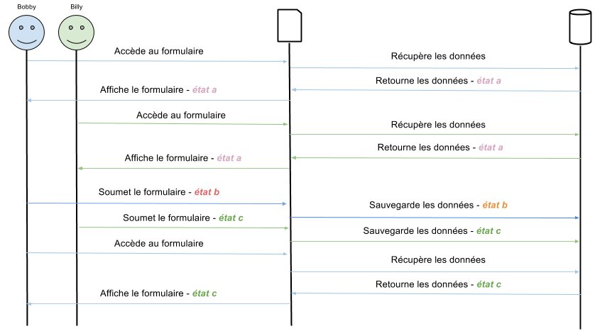

## Introduction à l'accès concurrentiel
On parle d'accès concurrentiel lorsque plusieurs consommateurs (utilisateurs ou transactions) accèdent à une même ressource (donnée) en même temps.

Les utilisateurs qui modifient des données peuvent interférer avec d'autres utilisateurs en train de lire ou de modifier ces mêmes données au même instant : on dit alors qu'il y a concurrence dans l'accès à la donnée.  
Si votre système de stockage de données est dépourvu de contrôle des accès concurrentiels, les utilisateurs peuvent constater des effets secondaires indésirables comme la perte de leurs mises à jour.  
_Cet article abordera l'accès concurrentiel à la donnée via un formulaire._

Les mises à jours perdues se produisent lorsqu'au moins deux transactions mettent à jour un même champ avec des valeurs différentes. Les transactions n'ayant pas connaissance des autres transactions, la dernière mise à jour écrase les autres mises à jours effectuées par les autres transactions, ce qui entraîne une perte de données.

Prenons l'exemple de deux analystes travaillant sur un même formulaire d'édition d'une donnée contenant plusieurs centaines de champs.  
Notre premier utilisateur, que l'on nommera _Bobby_, modifie depuis plusieurs minutes des champs de ce formulaire, lorsque notre second utilisateur, _Billy_, arrive sur le formulaire à son tour.  
_Bobby_ décide de sauvegarder toutes ses modifications. _Billy_ quant à lui, corrige une faute d'orthographe dans un champ et sauvegarde à son tour, après _Bobby_. _Billy_ a écrasé sans le savoir toutes les modifications que _Bobby_ a effectué.

  
_A la fin, le travail de Bobby n'est plus stocké en base de données : Billy l'a écrasé avec ses modifications._


## Les deux types de contrôle de concurrence : optimiste et pessimiste
Lorsque plusieurs consommateurs (personnes ou transactions) tentent de modifier les mêmes données en même temps, il est recommandé d'implémenter un système de contrôle de concurrence de manière à ce que les modifications apportées par l'un ne pénalisent pas l'autre.

Il existe deux modèles de verrouillage pour les données d'une base de données :
- Le verrouillage optimiste, qui verrouille l'enregistrement uniquement lors de la validation des changements dans la base de données.
- Le verrouillage pessimiste, qui verrouille l'enregistrement au moment de son édition.

Dans ces deux mécanismes, le verrou est libéré après la validation des changements dans la base de données.


### Verrouillage optimiste
Le verrouillage optimiste autorise plusieurs utilisateurs à tenter de mettre à jour le même enregistrement, sans les informer de la présence d'autres utilisateurs. Les changements apportés à l'enregistrement sont appliqués uniquement lorsque celui-ci est validé.  
Si la mise à jour est validée et enregistrée, les autres utilisateurs qui tenteront de valider leurs mises à jours seront informés de la présence d'un conflit.


### Verrouillage pessimiste
Le verrouillage pessimiste empêche les mises à jours simultanées des données.  
Dès qu'une transaction accède à un enregistrement, un verrou est placé sur ce dernier. Les transactions qui tenteront par la suite de mettre à jour cet enregistrement seront informés qu'un autre transaction est en train d'effectuer une mise à jour : il devront alors attendre que la première transaction libère le verrou d'enregistrement.

L'avantage de ce modèle est qu'il empêche l'apparition de conflits, et permet ainsi d'éviter les problèmes liés à leur résolution. Mais il y a des risques d'interblocage (_deadlock_).


## Gestion avec Doctrine 2
Doctrine 2 supporte le verrouillage optimiste nativement pour vos entités, et le verrouillage pessimiste au niveau de la base de données.


### Verrouillage optimiste
Doctrine 2 supporte le verrouillage optimiste à l'aide d'un champ _version_. Toutes les entités qui doivent être protégées contre les accès concurrentiels doivent avoir ce champ : soit un entier, soit un timestamp. Il est recommandé d'utiliser un entier pour éviter des conflits dans un environnement hautement concurrentiel.

```php
<?php
namespace App\Entity;

use Doctrine\ORM\Mapping as ORM;

/**
 * @ORM\Entity()
 */
class Item
{
    // …

    /**
     * @var int
     * 
     * @ORM\Version
     * @ORM\Column(type="integer")
     */
    private $version;

    // …
}
```

Lorsqu'un conflit de version est rencontré pendant `EntityManager#flush()`, une exception `OptimisticLockException` est lancée et la transaction active est annulée.

A tout moment, il est possible de vérifier la version d'une entity en appelant les méthodes `EntityManager#find()` ou `EntityManager#lock()`.

```php
use Doctrine\DBAL\LockMode;
use Doctrine\ORM\OptimisticLockException;

$entityId = 1;
$expectedVersion = 42;

try {
    $entity = $em->find('MyEntity', $entityId, LockMode::OPTIMISTIC, $expectedVersion);

    // Do the work, there is no concurrency
} catch (OptimisticLockException $e) {
    // There is concurrency
}
```

ou

```php
use Doctrine\DBAL\LockMode;
use Doctrine\ORM\OptimisticLockException;

$entityId = 1;
$expectedVersion = 42;


$entity = $em->find('MyEntity', $entityId);

try {
    // assert version
    $em->lock($entity, LockMode::OPTIMISTIC, $expectedVersion);

    // Do the work, there is no concurrency
} catch (OptimisticLockException $e) {
    // There is concurrency
}
```

Pour utiliser la concurrence optimiste, vous devez ajouter la version dans un champ caché de votre formulaire ou dans une session pour plus de sécurité. L'objectif étant de restituer la version fournie de la base de donnée lors de la récupération des données du formulaire d'édition.

La requête GET (Formulaire) :
```php
$entityId = 1;
$entity = $em->find('MyEntity', $entityId);

// …
echo '<input type="hidden" name="id" value="'. $entityId .'" />';
echo '<input type="hidden" name="version" value="'. $entity->getVersion() .'" />';
// …
```

La requête POST / PUT :
```php
use Doctrine\DBAL\LockMode;

$entityId = (int) $_POST['id'];
$version = (int) $_POST['version'];

$entity = $em->find('MyEntity', $entityId, LockMode::OPTIMISTIC, $version);
```


### Verrouillage pessimiste
Doctrine 2 supporte le verrouillage pessimiste au niveau de la base de données, et il n'est pas nécessaire de modifier vos entités pour l'utiliser.

Doctrine 2 supporte deux modes :
- `Doctrine\DBAL\LockMode::PESSIMISTIC_WRITE` : Verrouille les entrées en base de données pour des opérations de lecture et d'écriture.
- `Doctrine\DBAL\LockMode::PESSIMISTIC_READ` : Verrouille les entrées en base de données pour des opérations d'écriture.

Il est nécessaire de démarrer une transaction manuellement : Doctrine 2 lancera une exception si vous essayez d'acquérir un verrou pessimiste et qu'aucune transaction n'est en cours.

```php
use Doctrine\DBAL\LockMode;

$entityId = 1;

$em->getConnection()->beginTransaction();

try {
    $entity = $em->find('MyEntity', $entityId, LockMode::PESSIMISTIC_WRITE);

    // Do stuff

    $em->flush();
    $em->getConnection()->commit();
} catch (\Exception $e) {
    $em->getConnection()->rollback();

    throw $e;
}
```

Je vous conseille fortement de lire <a href="http://doctrine-orm.readthedocs.org/projects/doctrine-orm/en/latest/reference/transactions-and-concurrency.html" target="_blank">la documentation de Doctrine 2 sur ce sujet</a> pour un complément d'informations.


## Conclusion
Chez Profideo, nous avons mis en place le verrouillage optimiste dans certains de nos projets récents, notamment sur nos formulaires à haut risque de concurrence.  
Cette solution nous permet de fournir à nos clients des applications sans risque de perte de données dues à des manipulations par plusieurs acteurs.
